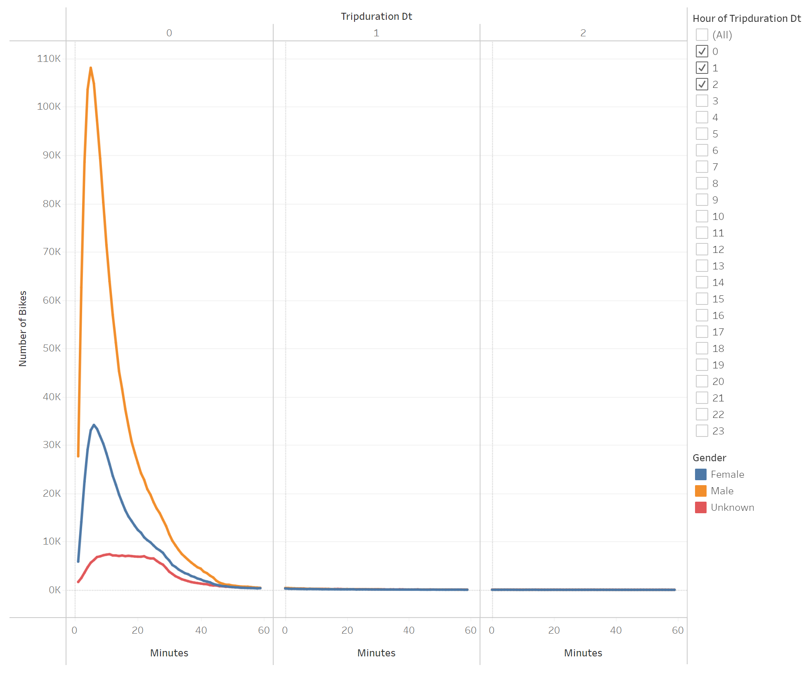
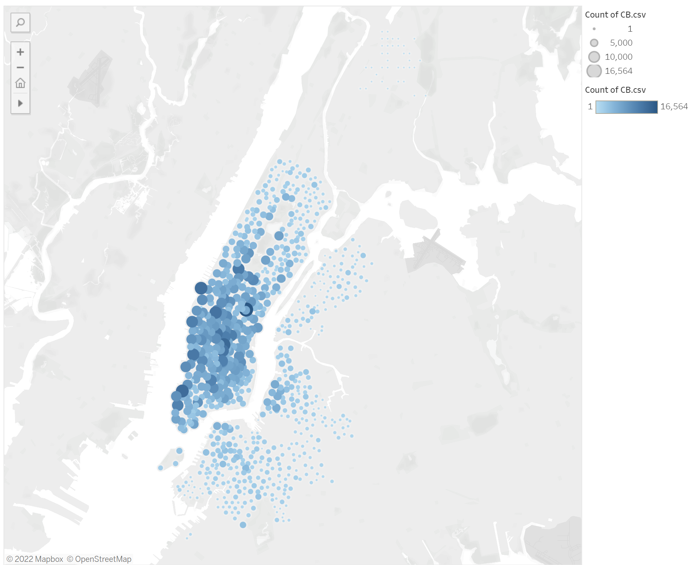
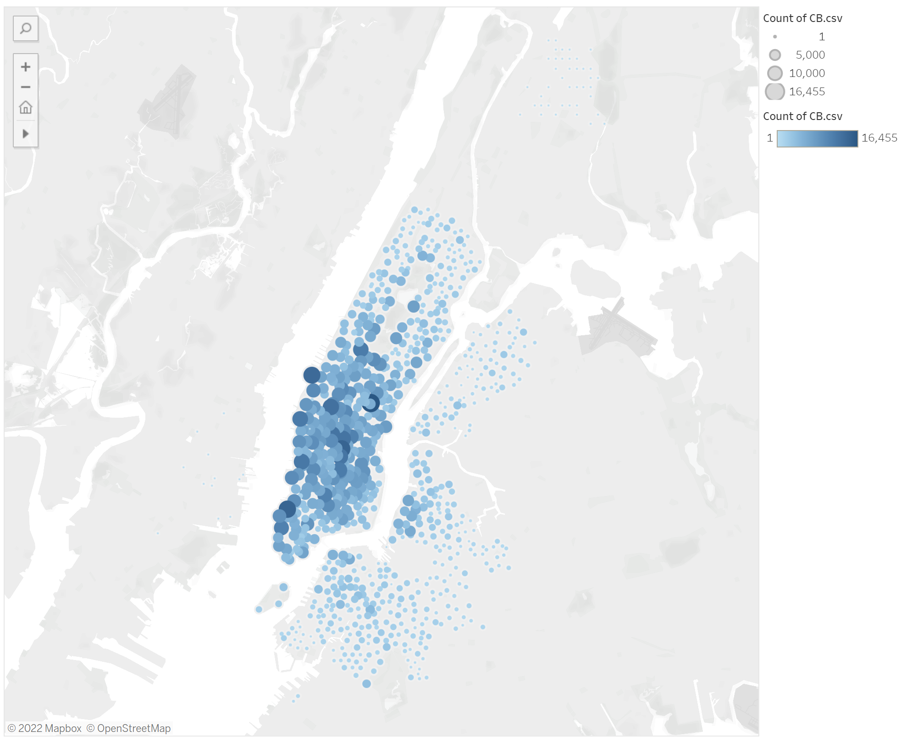
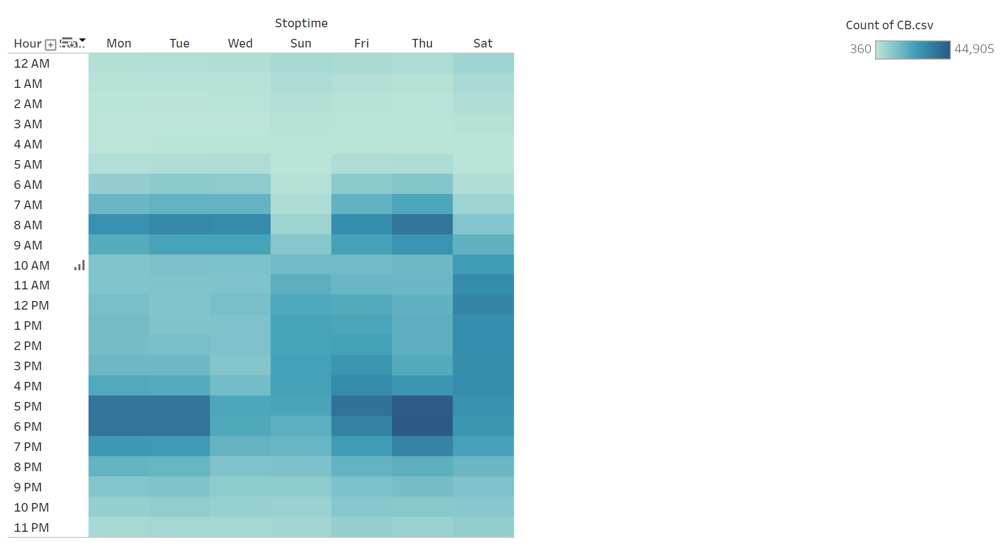
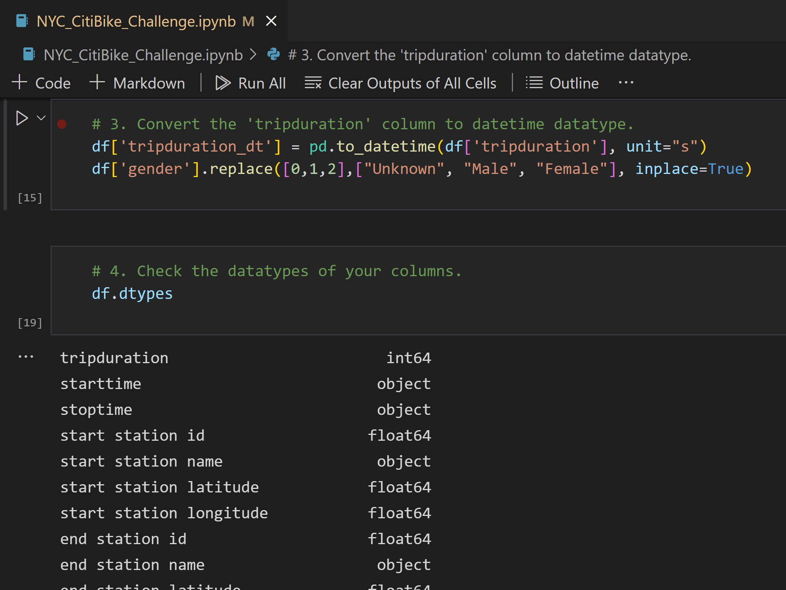

# Bike Sharing

## Deployed to [Dashboard](https://public.tableau.com/app/profile/christopher5658/viz/DesMoinesBikeSharing-Challenge/DesMoinesBikeSharing-Challenge?publish=yes)

## Overview of Bike Sharing Analysis

My friend Kate and I went on a trip to New York City for two weeks where we visited all of the famous attractions.  An unexpected and pleasant part of the trip was riding around the city on rented bicycles.  We loved the experience so much that we wanted to bring bike rentals to our hometown in Des Moines, Iowa.  While brainstorming our venture, Kate found a potential investor to back the company in its infancy stages.  Before moving forward, Kate's investor wants to understand more about the bike sharing industry.  After all, the mechanics of running this business in New York could be different than Des Moines.  This page explains our analysis of Citi Bike.  
 
### Resources

* Data Source:  201908-citibike-tripdata.csv, CB.csv
* Software:  Visual Studio Code 1.38.1, Python, Tableau Public

## Results

After isolating dimensions common to both New York and Des Moines, Kate and I imported a subset of data to analyze Citi Bike ride sharing for August 2019.  We built a Tableau story to communicate the results of our analysis.  This github page intends to summarize the story results. To see the entire story, please click the link at the top of the README.

### Chart 1

Bike Checkout by Gender:

Key Takeaway:  Most riders are male, and most trips are less than one hour.

### Chart 2

Top Starting Locations:

Key Takeaway:  The starting locations are concentrated in one area.

### Chart 3

Top Ending Locations:

Key Takeaway:  The ending locations are concentrated in one area.

### Chart 4

Bike Use per Hour:

Key Takeaway:  Most bike use is during commuting hours.

### Chart 4

Bike Use by User Type:

Key Takeaway:  Most bike users are subscribers.

## Summary and Recommendations

We can glean a lot of information from the charts above.  We can tell that the majority of our users are male subscribers commuting to and from work.  We can see that the trips are typically less than an 30 minutes with 5 minute trips being the norm.  As you'd expect to go hand-in-hand with short trips, the starting and ending locations are mostly close together.  Kate and I can use this data to focus our marketing on our service to male commuters in the Des Moines downtown district.      

To improve our analysis, I recommend we:

1.  Generate a worksheet with bike trips by age (workday per hour); and

2.  Generate a worksheet with the trip durations by user type.

### Code Snippets

index.html File:
